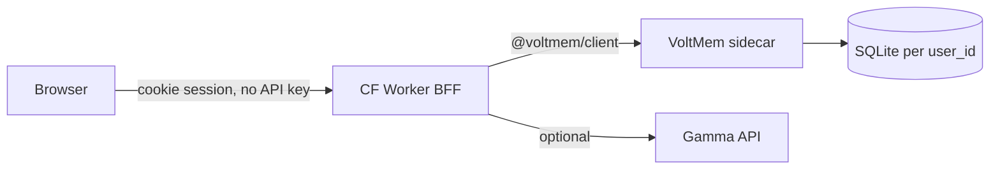

# TypeScript VoltMem playground (sibling project)

## What this achieves

A **public try-it URL** where anyone can see VoltMem’s job in ~30 seconds — not a trading bot.

**Use case:** prediction markets mix three kinds of fact that normal agent memory smears together:

| Kind | Example | VoltMem behavior |
|------|---------|------------------|
| Contract | “Pays YES iff AP/Reuters by date D” | Almost frozen — rumor cannot rewrite |
| Tape | “YES mid 0.18 → 0.41” | Slot domain — latest tick wins |
| World / rumor | “AP: suspended” vs “tweet: dropping out” | World updates on strong evidence; rumor sits as twin |

The walkthrough makes the wedge visible: VoltMem keeps **0.41** (not 0.18), refuses a tweet rewriting resolution rules, and beats an **always-add** haystack on search. Live Polymarket Gamma ingest is optional garnish (identity + rules + mid), not order placement.

**Audience:** README / paper / social visitors who will not `pip install` first.

**Out of scope:** +EV, CLOB orders, UMA resolution, production research desk.

---

## Repo layout

```text
~/Projects/voltmem/              # library only (no playground folder)
~/Projects/voltmem-playground/   # new sibling app (own git repo)
```

The playground is **not** inside voltmem. It depends on:

- [`clients/typescript`](clients/typescript) — `@voltmem/client` via `file:../voltmem/clients/typescript`
- VoltMem HTTP sidecar — real engine ([`sidecar/`](sidecar/), [`docs/SIDECAR.md`](docs/SIDECAR.md))

---

## Architecture



- **Static UI** — served from Worker `assets` (`public/`: walkthrough, ledger, search, freeform write).
- **BFF Worker** — holds `VOLTMEM_URL` + `VOLTMEM_API_KEY` as secrets; issues per-tab `user_id` via cookie; never exposes the key to the browser.
- **Always-add baseline** — replayed in the Worker from the same event log (keyword overlap search). Not VoltMem; contrast only.
- **Sidecar** — Docker/Fly with `VOLTMEM_PROFILE=markets` (new profile). Public HTTPS URL required in prod.

---

## Walkthrough (PM-X scripted demo)

Seven steps, replayed through the sidecar:

1. Lock contract terms (named wire, not social)
2. Market identity (PM-X ≠ general-election sibling)
3. Tape: mid 0.18
4. Tape: mid 0.41 (slot update)
5. Rumor twin (`weak_inference`, `contested_claim`)
6. Rumor tries to rewrite rules → expect `logged_mismatch`
7. AP wire updates world (`underlying_state`)

Three search probes after Play:

- “Current YES mid?” → **0.41** (always-add may still surface 0.18)
- “Resolution source / is YES resolved?” → named wire, not Twitter
- “Did candidate suspend?” → AP report, not contract text

---

## Small voltmem changes (library surface, not playground code)

These stay in **voltmem**, not the sibling app:

1. **`markets` sidecar profile** in [`sidecar/profiles.py`](sidecar/profiles.py)
   - Domains: `contract_terms` (0.06), `market_identity` (0.10), `underlying_state` (0.40), `market_state` (0.92, slot), `contested_claim` (0.85)
   - `KeywordClassifier` map for freeform writes

2. **`domain` on memory add API**
   - Sidecar: accept optional `domain` on `POST /v1/users/{id}/memories` → pass to `layer.remember(..., domain=...)`
   - TS client: add `domain?: string` to `AddOptions` in [`clients/typescript/src/types.ts`](clients/typescript/src/types.ts)

3. **Slot tape policy** (if hashing similarity confirms 0.18 vs 0.41)
   - Either sidecar slot-replace when same domain + different value, or Worker sends explicit high-mismatch observe path
   - Prefer fixing in engine/sidecar so the demo is honest, not a playground hack

No reimplementation of escalation / composite / linking in TypeScript.

---

## Sibling app structure

```text
voltmem-playground/
  wrangler.jsonc
  package.json
  public/
    index.html
    app.js
    styles.css
  src/
    index.ts          # Worker routes
    scenario.ts       # walkthrough steps + probes (shared constants)
    always-add.ts     # naive baseline search
    gamma.ts          # optional live market fetch + normalize to writes
  README.md
```

**Worker routes (sketch):**

| Route | Purpose |
|-------|---------|
| `GET /` | Static UI |
| `GET /api/meta` | Domains, walkthrough, probes |
| `POST /api/apply` | Replay event list → sidecar writes + search |
| `GET /api/live` | Proxy Gamma → normalized ingest events |
| `POST /api/reset` | `clear()` for session user |

---

## Deploy

1. **Sidecar** — build from voltmem Dockerfile; set `VOLTMEM_API_KEY`, `VOLTMEM_PROFILE=markets`, persist `/data`. Fly.io per [`docs/SIDECAR.md`](docs/SIDECAR.md).
2. **Playground** — `cd ~/Projects/voltmem-playground && npm install && npm run build` (client); `wrangler secret put VOLTMEM_URL` / `VOLTMEM_API_KEY`; `wrangler deploy`.
3. **Public URL** — `https://voltmem-playground.<account>.workers.dev`

Requirements: Node 22+ (wrangler 4.x), Cloudflare login (`wrangler login` — token was expired in prior session).

---

## Cleanup note

Prior in-repo Python playground (`playground/`, `tests/test_playground.py`, README edits) should **not** exist in voltmem. Current git status shows that work is already gone; confirm before starting sibling scaffold.
