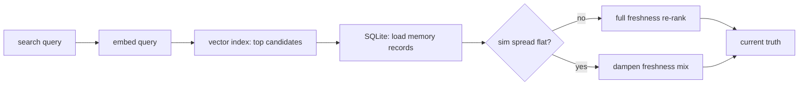

# VoltMem

[](https://pypi.org/project/voltmem/)
[](https://pypi.org/project/voltmem/)
[](https://github.com/Rouche01/voltmem/blob/main/LICENSE)

**Current-truth memory for LLM agents.**

Most memory layers treat every fact the same — your hometown and today's mood get equal
weight. That forces a bad tradeoff: go **stale** on fast-changing facts, or get
**corrupted** when a confident-but-wrong update overwrites something durable.

VoltMem scales protection and retrieval freshness by **how fast each kind of fact
actually changes**. Volatile facts update; stable facts resist corruption; stale
volatile memories rank lower at search time.

> Mem0 remembers relevant facts. VoltMem remembers **current truth**.

**Research & benchmarks:** [docs/RESEARCH.md](docs/RESEARCH.md) · **Known limits & roadmap:** [docs/OPEN_PROBLEMS.md](docs/OPEN_PROBLEMS.md)

### What’s new in 0.2.2

- **Adaptive freshness mix** — when top candidates have nearly equal similarity
  (under-specified queries), VoltMem dampens the volatility penalty so freshness
  cannot dominate near-ties; clear similarity gaps keep full freshness behavior
- **`domain_stats()`** — always-on prior calibration telemetry (insert / confirm /
  mismatch / audit counts and rates per domain); does not require `auto_discover`
- **Calibration histogram** — `experiments/prior_calibration_hist.py` (ASCII + SVG)

---

## Install

```bash
pip install voltmem[embeddings]
# from source:
# pip install -e ".[embeddings]"
```

Core library has **zero required dependencies**. Embeddings extras pull in
`sentence-transformers` (recommended). LangChain: `pip install -e ".[langchain]"`.
HTTP sidecar (FastAPI): `pip install -e ".[sidecar]"` — see [sidecar/README.md](sidecar/README.md).

---

## Quickstart

```python
from voltmem import create_memory

mem = create_memory("app.db", user_id="alice")

mem.add("I live in Berlin")
mem.add("I prefer concise, direct answers")
mem.add("Actually I moved to Paris last month")   # updates location, not prefs

hits = mem.search("where does the user live?", limit=3)
print(hits[0]["memory"])   # Actually I moved to Paris last month
```

### Message pairs (auto fact extraction)

```python
mem.add([
    {"role": "user", "content": "I moved to Paris. I'm working on a DB migration."},
], extract=True)   # default for message lists — splits into atomic facts
```

Optional: `create_memory(..., llm_extract=True)` for Ollama-powered extraction.

### Inject into a prompt

```python
memories = mem.search(user_message, limit=5)
context = "\n".join(f"- {m['memory']}" for m in memories)
system = f"What you know about this user:\n{context}"
```

---

## API

| Method | Description |
|---|---|
| `create_memory(db, user_id)` | Factory with auto-detected embeddings + vector index |
| `Memory.add(text \| messages)` | Store a fact; slot-aware linking updates related memories |
| `Memory.search(query, limit=5)` | ANN candidates + volatility re-rank (relevance + freshness; adaptive mix on similarity plateaus) |
| `Memory.domain_stats()` | Per-domain prior calibration telemetry (audit / mismatch / confirm rates) |
| `Memory.get_all()` | All active memories for this user |
| `Memory.delete(id)` | Remove one memory |
| `Memory.clear()` | Wipe user namespace |

Advanced: `mem.layer` exposes `MemoryLayer` for low-level `observe()` / `write()`.

`create_memory(..., vector_index="auto")` enables a SQLite embedding index when an
embedder is present (`"off"` restores full-scan retrieval). VoltMem always applies
volatility re-ranking on top of vector candidates — not raw ANN results.

```python
stats = mem.domain_stats()
# {
#   "location": {"prior": 0.6, "audited": 4, "logged_mismatch": 2,
#                "confirmed": 10, "audit_rate": 0.25, ...},
# }
```



---

## Why VoltMem

| Problem | ADD-only memory | VoltMem |
|---|---|---|
| User moves cities | Berlin and Paris both stored | **Updates** to current city |
| Old project name in haystack | Ranks by similarity | **Down-ranks** stale volatile facts |
| Confident wrong blip on stable pref | Often accepted | **Resists** corruption |
| Career / role change (medium-stable) | Often blocked or duplicated | **Updates** on strong explicit contradiction |

### Example results (reproducible)

Run locally with `pip install -e ".[embeddings]"`. Embeddings:
`sentence-transformers` (`all-MiniLM-L6-v2`).

**`examples/contradiction_demo.py`** — 5-turn script vs naive always-add:

| After scenario | always-add | VoltMem |
|---|---|---|
| User moves Berlin → Paris | 2 location facts (stale + current) | **1** current fact |
| Paraphrase blip on stable pref | adopts blip ("really like short replies") | **keeps** original ("concise, direct answers") |

**`experiments/mem0_comparison.py`** — 3 scenarios, top-1 search (always-add baseline):

| Scenario | always-add | VoltMem |
|---|---|---|
| `location_update` | WIN (2 facts stored) | WIN (**1** fact) |
| `stable_pref_blip` | LOSE | **WIN** |
| `volatile_mood` | LOSE (stale "great") | **WIN** (current "stressed") |

**VoltMem clearer wins: 2/3** (always-add also finds Paris on location, but keeps stale facts).

**`experiments/mem0_side_by_side.py`** — same 3 scenarios vs **real Mem0**
(open-source, `gpt-4o-mini` + `text-embedding-3-small`):

| Scenario | Mem0 | VoltMem |
|---|---|---|
| `location_update` | LOSE (stale "Berlin", 2 facts) | **WIN** ("Paris", 1 fact) |
| `stable_pref_blip` | PARTIAL (adopts blip) | **WIN** (keeps "concise") |
| `volatile_mood` | LOSE (stale "great", 2 facts) | **WIN** ("stressed", 1 fact) |

**VoltMem clearer wins: 3/3.** Mem0 keeps contradictory facts; VoltMem updates volatile
slots and protects stable prefs via domain volatility + slot-aware linking.

**`experiments/voltmem_eval.py`** — end-to-end escalation + retrieval (real vs flat vs swap):

| Battery | real profile | flat (equal V) | swap (inverted V) |
|---|---|---|---|
| A — selective updating | **20/20** | 15/20 | 7/20 |
| B — retrieval separation | **+0.589** | +0.202 | −0.267 |

Includes the `professional_context` career-change probe (strong explicit evidence → update).

**`experiments/memory_demo.py`** — 3 final Q&A checks vs ground truth:

| Policy | Score |
|---|---|
| **VoltMem** | **3/3** |
| never-overwrite | 2/3 |
| always-overwrite | 1/3 |
| reliability-threshold | 1/3 |

VoltMem is the only policy that both **rejects confident false blips** on stable
facts and **tracks weak-but-true updates** on volatile ones. Full distributions:
[docs/RESEARCH.md](docs/RESEARCH.md) (`llm_memory_bench.py`).

```bash
python examples/contradiction_demo.py
python experiments/mem0_comparison.py
python experiments/mem0_side_by_side.py   # pip install mem0ai; OPENAI_API_KEY or MEM0_BACKEND=ollama
python experiments/voltmem_eval.py        # 20/20 escalation probes + retrieval separation
python experiments/memory_demo.py
```

---

## Integrations

### LangChain

```bash
pip install -e ".[langchain]"
python examples/langchain_agent.py
```

```python
from voltmem.integrations.langchain import VoltMemMemory

memory = VoltMemMemory(session_id="user-42", db_path="app.db")
memory.load_memory_variables({"input": "Where do I live?"})
memory.save_context({"input": "I moved to Paris"}, {"output": "Noted."})
```

### Multi-tenant

One SQLite file, many users — `user_id` maps to an isolated namespace:

```python
alice = create_memory("app.db", user_id="alice")
bob   = create_memory("app.db", user_id="bob")
```

### HTTP sidecar / TypeScript

For Cloudflare Workers and other TypeScript apps, run VoltMem as an HTTP sidecar
instead of porting the engine. The Worker stays thin and calls REST
(`add` / `search` / `domain_stats`).

```bash
pip install -e ".[sidecar,embeddings]"
VOLTMEM_API_KEY=secret VOLTMEM_DB_PATH=./voltmem_sidecar.db python -m sidecar
# Docker: docker build -t voltmem-sidecar . && docker run -p 8080:8080 -e VOLTMEM_API_KEY=secret -v voltmem-data:/data voltmem-sidecar
```

Full routes, env vars, and curl examples: [sidecar/README.md](sidecar/README.md).
A Workers-safe `@voltmem/client` TypeScript SDK: [clients/typescript](clients/typescript).

---

## Examples

| Script | What it shows |
|---|---|
| `examples/contradiction_demo.py` | VoltMem vs always-add on contradictions |
| `experiments/mem0_comparison.py` | 3-scenario head-to-head vs always-add |
| `experiments/mem0_side_by_side.py` | 3-scenario head-to-head vs real Mem0 (3/3 wedge) |
| `experiments/voltmem_eval.py` | End-to-end escalation + retrieval (20/20 probes, real > flat > swap) + domain_stats footprint |
| `experiments/prior_calibration_hist.py` | ASCII + SVG histogram of audit_rate by domain (Battery A replay) |
| `experiments/retrieval_plateau_probe.py` | Synthetic Problem 3 plateau / clear-gap check |
| `experiments/calibrate_escalation.py` | Print E_t vs θ table for tuning explicit-override constants |
| `examples/quickstart_batteries.py` | `remember()` / `recall()` low-level API |
| `examples/multi_tenant.py` | One DB, many users |
| `examples/langchain_agent.py` | LangChain adapter |
| `examples/chat_app/` | Memory-aware CLI chat (extendable to web UI) |
| `examples/custom_classifier.py` | Pluggable ``KeywordClassifier`` + ``DomainRegistry`` |

### Chat app (CLI)

```bash
pip install -e ".[embeddings]"
python -m examples.chat_app              # REPL; uses Ollama if running, else echo mode
python -m examples.chat_app --demo       # scripted smoke test
python -m examples.chat_app --show-recall
```

Slash commands: `/memories`, `/search <query>`, `/clear`, `/reset`, `/help`.

---

## Domain volatility priors

| Domain | Volatility | Behavior |
|---|---|---|
| `personality_trait` | 0.05 | Very protected |
| `core_preference` | 0.08 | Very protected |
| `biographical` | 0.10 | High protection |
| `professional_context` | 0.30 | Medium — job/role (career changes) |
| `location` | 0.60 | Updates readily (Berlin → Paris) |
| `current_project` | 0.55 | Updates readily |
| `emotional_context` | 0.80 | Fast-moving |
| `current_task` | 0.90 | Minimal protection |

Custom domains: register via ``DomainRegistry`` and pass to ``create_memory(domains=...)``.
Pluggable classifiers: ``create_memory(classifier=...)`` — ``"heuristic"``, ``"llm"``, ``KeywordClassifier``, or a callable dict.

``mem.domain_stats()`` always records insert / confirm / mismatch / audit rates per
domain (prior calibration). Optional: ``create_memory(..., auto_discover=True)`` also
*blends* empirical volatility into scoring from those patterns (cold-start applies).

```python
from voltmem import create_memory, DomainRegistry, KeywordClassifier, ChainedClassifier, HeuristicClassifier

domains = DomainRegistry()
domains.register("style_preference", 0.08)
domains.register("style_constraint", 0.25)

mem = create_memory(
    "app.db",
    user_id="alice",
    domains=domains,
    classifier=ChainedClassifier([
        KeywordClassifier({
            "style_preference": ["prefer", "darker colors", "minimal"],
            "style_constraint": ["no wool", "tight budget"],
        }),
        HeuristicClassifier(),
    ]),
)

mem.add("I prefer darker colors and minimal fits")
hits = mem.search("what colors does the user like?")
```

---

## Development

```bash
pip install -e ".[all]"
python tests/test_voltmem.py
python tests/test_client.py
```

Experiments and benchmarks live in `experiments/` — see [docs/RESEARCH.md](docs/RESEARCH.md).
Open problems and roadmap: [docs/OPEN_PROBLEMS.md](docs/OPEN_PROBLEMS.md).

```bash
python experiments/prior_calibration_hist.py   # ASCII + experiments/out/*.svg
python experiments/retrieval_plateau_probe.py
```

---

## License

MIT
