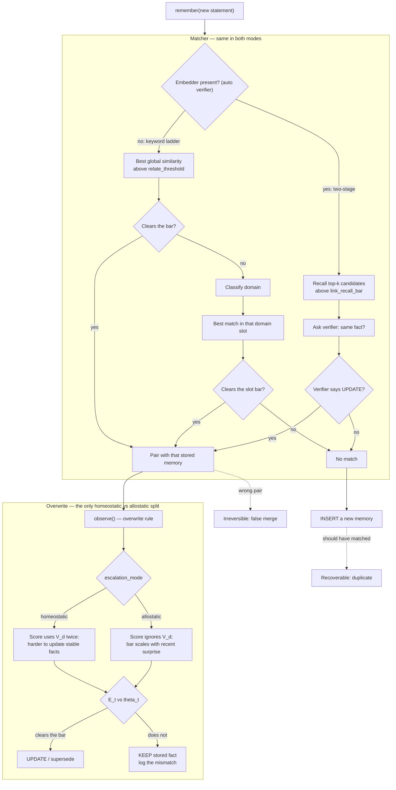

# From a Theory of Consciousness to an Improvement of VoltMem

## Part 1 — The Philosophical Arc

**1. Starting hypothesis: consciousness tracks dynamism**
Initial claim: the most conscious being is the one whose internal state is most disturbed by external effectors — i.e., raw sensitivity/volatility of internal state to external input.

**2. First objection: volatility alone is cheap**
A thermostat's state flips radically when perturbed, yet nobody considers it more conscious than a rock. Raw disturbability can't be the measure — what matters is the *structure* of the response, not its magnitude or frequency.

**3. Refinement: differentiation × integration**
Borrowed from Integrated Information Theory (Tononi/Massimini). A system is a stronger candidate for consciousness if it has:
- **Differentiation** — a large repertoire of distinguishable internal states/responses.
- **Integration** — that repertoire is produced by one system that cannot be decomposed into independent parts without losing information.

Neither alone suffices: high differentiation with no integration is just many independent parts running in parallel (a bundle of switches); high integration with no differentiation is a single wire — total unity, but only two possible states.

**4. Second objection: dynamism was never the target**
Reframing: the goal isn't a system that gets pushed around a lot — it's a system that can *absorb and correct for* a wide range of perturbations while maintaining internal coherence. Internal state change becomes an incidental side effect of regulation, not the point. This is a move from "consciousness = disturbability" to "consciousness = regulatory competence."

**5. Formal home for this move: the Free Energy Principle / Active Inference (Friston)**
A system that persists as a distinct entity keeps its internal states within a viable range against a perturbing environment, via two channels:
- **Perception** — update the internal model to match the world.
- **Action** — act on the world to match the internal model.

Consciousness, on this view, tracks the depth/sophistication of this error-correcting loop — specifically, how much of a perturbation the system can *anticipate and neutralize before it registers as a raw internal jolt*. Paradoxically, a more conscious system may look calmer, not more volatile, because it's absorbing disturbance predictively.

**6. Homeostasis vs. Allostasis as the operative distinction**
- **Homeostasis** — regulation toward a *fixed* setpoint, reactive, triggered after deviation is detected.
- **Allostasis** (Sterling) — regulation via *anticipated, context-dependent, shifting* setpoints, proactive.

**Hypothesis:** the measure of consciousness is the *range* of allostatic (vs. homeostatic) regulation a system is capable of — how much of its self-regulation is anticipatory, context-sensitive, and setpoint-shifting rather than fixed and reactive.

**7. The "net" question**
Where does experience itself come from, on this model? Three candidate readings:
- **Residual/prediction-error reading (strongest, best literature support — Friston, Clark, Seth):** experience is the leftover mismatch between what the system's allostatic model anticipated and what actually occurred. Predicts that experience is most vivid at moments of surprise/violation and thins out as prediction improves (habituation).
- **Mode-arbitration reading:** experience arises at the seam where the system is negotiating between homeostatic and allostatic control, not in either channel alone.
- **Aggregate reading:** experience as the sum of both systems' total activity — collapses back to the original (rejected) dynamism hypothesis.

The residual/prediction-error reading was adopted as the strongest candidate. Important caveat: this gives a plausible *trigger condition* / correlate for experience, not an explanation of why any information processing should be accompanied by subjective experience at all (the hard problem remains open).

---

## Part 2 — Formalization

### 2.1 Allostatic range metric

For a controlled variable *i*, define three components:

| Symbol | Meaning | Low value example | High value example |
|---|---|---|---|
| `H_i` | Horizon — how far ahead the system anticipates and acts before a perturbation hits | Reflex correction after deviation detected | Perception-driven action taken well before impact |
| `R_i` | Retargetability — can the setpoint itself move, across how many variables, independently | Fixed setpoint | Many setpoints shifting independently |
| `C_i` | Context-sensitivity — how much of the space of possible contexts actually drives the retargeting | Setpoint shifts on a blind fixed rule (e.g., a clock) | Setpoint shifts based on a rich combinatorial read of context |

Per-variable allostatic range:
```
A_i = H_i × R_i × C_i
```
Multiplicative (not additive) because each term is near-useless without the others — this mirrors the differentiation × integration requirement in Part 1.3.

System-level range should be integration-weighted (not simply summed) across variables, discounting variables regulated by non-communicating subsystems — otherwise independent parallel regulators inflate the score without genuine unification (same trap as pure differentiation without integration).

### 2.2 Residual / prediction-error signal

Given an internal generative model producing an expectation `Ê_t` at time `t`, and an observed outcome `O_t`:
```
r_t = distance(Ê_t, O_t)
```
This is the quantity proposed (Part 1.7) as the correlate of experience: the part of the perturbation the allostatic model *failed* to anticipate.

### 2.3 Combined view

A system's moment-to-moment "conscious-like" signal is not raw disturbance, but residual-after-anticipation, and its capacity for consciousness (in the trait sense) is its allostatic range `A_i` aggregated across variables. A highly allostatic system, under this view, should show large `A_i` but small typical `r_t` — it's built to absorb most perturbation predictively, with residual appearing mainly at the edges where its model is under-fit.

---

## Part 3 — Mapping onto VoltMem

### 3.1 The existing architecture, restated in this vocabulary

| VoltMem component | Maps to |
|---|---|
| EWC baseline (fixed elastic penalty per weight, anchored to old value) | Pure homeostasis — fixed setpoint, reactive, zero context-sensitivity (`R ≈ 0`, `C ≈ 0`) |
| Domain volatility scalar `V_d` | A slow, domain-level allostatic prior — context-informed (`C > 0`) but computed retrospectively from history, not from live surprise |
| Escalation trigger (homeostatic, `V_d`-driven) | A coarse version of allostatic retargeting — one context signal, no online residual term |

### 3.2 The gap this analysis identifies

`V_d` alone conflates two signals that the philosophical model treats as distinct:
1. A slow domain-level *prior* about volatility (allostatic, but non-reactive to current state).
2. A fast, per-step *residual* — the model's live mismatch between expectation and observation (the `r_t` from Part 2.2).

A domain can be historically volatile (`V_d` high) while currently well-predicted (`r_t` low) — under the current single-scalar design this case is indistinguishable from a domain that is both historically and currently volatile. The philosophical model predicts these should be treated very differently.

### 3.3 Proposed enhancement

**Combined trigger:**
```
E_t = V_d^a · r_t^b        (a, b tunable, start at 1)
```
where `r_t` is a per-batch or per-step surprise measure, e.g. z-scored loss surprise:
```
r_t = |L_t − EMA(L)_{t−1}| / (σ_L + ε)
```
or, for richer signal, KL divergence between predicted and actual output distribution at step `t`.

**Mode-switching layer** (the more structurally novel addition — implements Part 1.6's homeostasis/allostasis as a *dynamic*, not fixed, property per domain):
```
m_d(t) = EMA(r_t, long window)
```
- Sustained low `m_d` → elastic penalty `λ_i` relaxes toward `λ_max` (domain "settles" into homeostatic protection, EWC-like).
- Rising `m_d` → `λ_i` relaxes toward `λ_min` (domain reopens into allostatic plasticity).

This gives domains the ability to move between regulatory modes over time, rather than being assigned a single volatility-derived weight for their lifetime — directly implementing the philosophical claim that allostatic *range*, not a fixed allostatic *amount*, is the relevant quantity.

### 3.4 Experiment design

Reuse the existing retention/adaptation benchmark used against EWC. Compare four variants:

1. EWC (baseline)
2. VoltMem, `V_d` only (homeostatic)
3. VoltMem + residual gate: `E_t = V_d · r_t`, no mode-switching
4. VoltMem + residual gate + mode-switching

**Metrics:**
- Retention accuracy on old domains
- Adaptation speed on new domains
- **Forgetting-after-recency** (the key diagnostic): performance on a domain that was stable for a long period and then suddenly shifted character. Variant 4 should outperform Variant 2 specifically here, since a static `V_d` cannot detect the shift while `m_d`/`r_t` can.

If variant 4 wins specifically on the forgetting-after-recency metric and not uniformly across the board, that's strong evidence the residual/mode-switching mechanism is adding a real, distinct capability rather than just extra tunable capacity.

---

## Results

Implemented behind `escalation_mode="allostatic"` (default remains `"homeostatic"`; `"current"` is still accepted as an alias). Two ingredients change together relative to the control law: `V_d` leaves the escalation score, and `θ_t` is scaled by `s(m)`, a decayed readout of recent surprise. Run `experiments/allostatic_ablation.py` to reproduce.

**The two ingredients do different jobs, and the first one is the load-bearing one for explicit contradictions.** Sweeping the `V_d` exponent in `E_t` (`p = 1` is the control law, `p = 0` is allostatic) crossed with `s(m)` on/off: only `p = 0` recovers the recency-shift cases, and it's a cliff rather than a gradient — the entrenched career change clears the bar by ~27% at `p = 0` and misses by ~6% at `p = 0.25`. `s(m)` changed no outcome at any `p`. The prior double-charging of volatility (numerator of `E_t` *and* denominator of `θ_t`) was the actual defect.

That margin sits directly on the `EXPLICIT_E_RATIO` θ-cap, so the win depends on a hand-tuned constant. Robustness to domain misclassification is therefore the main open risk: `p = 0` discards the score's only domain-sensitivity, and the heuristic classifier is ~84% accurate. Untested.

**`s(m)` needed a probe that Battery C structurally could not provide.** Every recency-shift probe ends in an explicit `M = 0.90` statement, which clears the medium-band θ-cap no matter what `s(m)` does. Battery D fixes this: `weak_inference` only (`R = 0.4`), below both the θ-cap and the cumulative N-strike override, so nothing but `s(m)` can reopen the bar. This is the accumulated-weak-evidence case from `SLEEPTIME_COMPUTE.md` — a job change arriving as casual mentions rather than one clear statement.

There, `s(m)` drives `θ` from 0.500 to 0.2941 against `E_t = 0.2940`: the surprise EMA's fixed point under a constant weak stream converged to within 2e-4 *above* the trigger and never crossed. The mechanism was doing nearly all the required work and stopping just short. A sweep of `S_MIN` × half-life found 9 of 10 settings catch the change with all three negative controls holding in every cell, and Battery A/B/C bit-identical throughout — the shipped 14-day half-life was the single failing corner. Raised to 30 days: caught at turn 10, the most conservative firing point available.

**What makes this a capability rather than added plasticity** is the spread-thin control: identical evidence, identical count, only the spacing differs, and the outcome flips. Sixteen daily mentions reopen the memory; the same sixteen spread monthly decay instead of accumulating. That is the horizon term of §2.1 behaving as specified, and it only works because recent surprise is time-decayed. An earlier implementation keyed `s(m)` to the lifetime `mismatch_count`, which could only ratchet open — no route back to settled, so a long-lived memory would grow permanently more plastic with age. Fixing that (14-day, now 30-day half-life on a persisted `surprise_at`, confirms pulling the EMA down) was a precondition for evaluating the mechanism at all.

Net: `E_t` without `V_d` handles explicit contradiction of entrenched facts; `s(m)` handles change that arrives as accumulated weak evidence, which no exponent setting can catch. Both are needed, for different failure modes. Battery A stays 20/20 under real priors with `real > flat > swap` intact.

### The cost, and why the mode stays opt-in

Battery E (`experiments/label_noise_eval.py`) drives escalation with the real classifier's error structure — its actual confusion pairs and per-domain error rates over the labeled corpus, rather than invented noise. Ground truth stays tied to the true domain, since a classifier mistake does not change whether a memory ought to be updated. Errors are counted by type, because they don't cost the same: a **false update** overwrites a true stable fact and is irreversible, while a **missed update** leaves a memory stale and is recoverable from later evidence.

At the classifier's real error rate, allostatic loses 1.1 points of accuracy (93.8% vs 94.9%) but produces **20% more false updates** (1.12 vs 0.93 per 18 probes). Under a forced 50% mislabel rate the gap widens to 3.44 vs 2.84. Every allostatic-only failure is the same shape: a very-stable fact (`personality_trait` V=0.05, `biographical` V=0.10) misread into the medium or volatile band, then contradicted by *weak* evidence.

This inverts the framing above. The double `V_d` charge is not simply a defect — under a wrong label it functions as **insurance**. Because the control law discounts the score by `V_d` as well as raising the bar, a mislabeled stable fact still scores too low for weak evidence to carry, and survives. Allostatic drops that discount, and with it the insurance. Removing the double charge fixes career changes and breaks mislabeled traits; it is a genuine trade, not a free win. `test_label_error_insurance_is_what_allostatic_gives_up` pins the specific case so the trade cannot change silently.

The ablation already ruled out the obvious compromise: `p` between 0 and 1 loses the recency-shift win entirely (cliff at `p = 0`), so partial `V_d` buys nothing. A composite gate is the remaining option — take the allostatic score only when evidence is explicit and high-`M`, or when surprise has already accumulated, and keep the `V_d` discount otherwise — since Battery E's failures are all weak-evidence-on-settled-item, which is exactly the region neither Battery C nor D depends on.

**Recommendation: keep `escalation_mode="homeostatic"` as the default.** Allostatic is safe to enable where the caller supplies `domain=` explicitly rather than relying on inference: at zero label noise it scores 100% on Battery A and wins C. The distinction is principled rather than a fudge, because the two modes differ precisely in how much they trust the domain label.

### First test — unexpected residual as surprise

The trap in detecting surprise was that `s(m)` was an EMA of raw `M_t` (how different the new sentence is from the stored one). Every method in the notes treats surprise as leftover mismatch after anticipation: `r_t = |M_t − Ê_t| / σ_t`, with domain `V_d` widening `σ` so ordinary noise on a volatile channel is expected.

Shipped that definition into `update_surprise_ema` (still opt-in; homeostatic mode does not read `s(m)`). `E_t` still uses `M_t`. Per-item `mismatch_ema` / `mismatch_var` persist `Ê` and scatter. Pass bar: C and D still win, E's extra false updates drop, and D is not a knife-edge.

| battery | result |
|---|---|
| C recency-shift | **hold** — 3/3, diagnostic still homeostatic=R / allostatic=U. C never needed `s(m)`; it rides dropping `V_d` from `E_t`. |
| D weak slow-burn | **fail to catch, succeed at not being a knife-edge** — daily weak stream now `never` for allostatic too. After a few hits `Ê ≈ M`, so `r_t → 0` and the bar stays shut. Controls (stable / confirms / monthly) still hold. |
| E label noise | **unchanged** — 93.8% vs 94.9%, false updates 1.12 vs 0.93. E's extra overwrites are one-shot `E_t` without `V_d` on a fresh item (`s(m) = 1`). Changing what `s(m)` means cannot touch a decision that does not read it yet. |

**Do not ship this as the Battery D fix.** It is the right *definition* of online surprise — same words after two weeks of asides are not surprising — and that is why D's pile disappeared from `s(m)`. Catching that pile is the second/third tests (gate on explicit high-`M` or high `r_t`; cumulative Bayesian surprise in sleeptime). E still needs the gate, not a better EMA.

`test_residual_surprise_is_distance_from_predicted_mismatch` and `test_allostatic_does_not_treat_a_predicted_weak_stream_as_surprise` pin the new behaviour so it cannot silently revert to an EMA of `M`.

### A much larger problem found on the way

An earlier version of this section blamed silent duplicate inserts on label noise. That was wrong, and the correct version matters more.

When an observation fails to match the memory it contradicts, it inserts a duplicate instead of resolving against it — and no escalation law is reached at all.

The matcher and the overwrite rule are sequential, not alternatives. Homeostatic vs allostatic only runs after a match. Both modes share every linking failure.



A miss never consults homeostatic or allostatic. A false pair *does* consult them, but on the wrong memory — so the mode can only change whether that wrong pair gets overwritten, not whether it was paired.

Battery F (`experiments/end_to_end_eval.py`) measures this by calling only `remember(text)`, so classification, routing, mismatch estimation, and escalation all have to work together. It crosses three similarity backends with an oracle-label condition (extractor forced to the true domain, isolating routing from classification) and the shipped condition (the real `HeuristicExtractor`, no injection):

| similarity | labels | routed | correct | correct given routed |
|---|---|---|---|---|
| keyword (default) | oracle | 22.2% | 22.2% | 100% |
| hashing (free) | oracle | 27.8% | 27.8% | 100% |
| sentence-transformers | oracle | 77.8% | 72.2% | 92.9% |
| sentence-transformers | shipped | 55.6% | 44.4% | 80.0% |

Corrected error budget for `remember()`:

1. **Similarity function — 50 points.** And it is *not* free: the dependency-free hashing backend recovers only 5.6 of those 50 points, 11% of the gain. This needs a real embedding model, not a cleverer bag of tokens.
2. **Classifier label error — 28 points.** Three times what Battery E's isolated measurement implied, because a wrong label mostly does its damage by *breaking routing* (77.8% → 55.6% routed) rather than by misleading the escalation math.
3. **Residual routing failure at best similarity — 22 points.** `relate_threshold`, the slot fallback, the sibling-domain sets.
4. **Decision error once routed — 5.6 points.** The control law is close to correct whenever it is actually consulted.

Batteries A–E cannot see items 1–3, because they hand the system its domain and its mismatch magnitude. Battery A's 100% is the control law given a perfect router; the composed system scores 44–72% depending on configuration.

**The finding that most undercuts the work above:** of the four probes that never route even with embeddings, two are `professional_context` (career change, explicit) and `long_term_goal` (goal change, explicit) — the exact scenarios allostatic mode was built to recover. The observation never finds the memory it contradicts, so the escalation law is never consulted, and the allostatic improvement is unreachable through the default `remember()` path no matter how well it is calibrated. Batteries C and D reach it only because they pass `domain=` explicitly.

Measured end-to-end at the best configuration, allostatic scores 77.8% against homeostatic's 72.2% with no false updates — but that is a one-probe difference out of 18 and should not be read as significant either way. With this few probes the end-to-end battery needs more cases before its rows carry weight individually; the 50-point and 28-point gaps are large enough to survive that caveat, the rest are not.

### Battery G — why the routing fix is not a threshold change

Battery F's conclusion invites an obvious repair: `professional_context` misses its link bar by 0.02, so lower the bar. Battery G (`experiments/linking_eval.py`) exists to check that first, because lowering a link bar also converts unrelated statements into **false merges** — and a false merge is strictly worse than a duplicate. A duplicate leaves both facts retrievable and reconcilable; a false merge treats two different facts as one and loses a true memory.

It pairs must-link cases (same underlying fact, so linking is required) against must-not-link cases (distinct coexisting facts, so linking destroys data), and measures the authoritative thing — how many memories survive two `remember()` calls — rather than modelling the threshold ladder. The corpus (`experiments/linking_pairs.py`) is 40 + 40 pairs, split into the original 24 that every threshold and verifier was fitted against and 56 written afterwards from a structural grid. Held-out rows are the only ones worth quoting.

| backend | split | must-link linked | false merges | min(pos) | max(neg) | separable | best possible errors |
|---|---|---|---|---|---|---|---|
| keyword (default) | dev | 3/12 | 6/12 | 0.11 | 0.80 | no | 12 |
| keyword (default) | held-out | 12/28 | 13/28 | 0.10 | 0.80 | no | 23 @ t=0.27 |
| hashing | held-out | 17/28 | 13/28 | 0.00 | 0.80 | no | 23 @ t=0.25 |
| sentence-transformers | dev | 10/12 | 5/12 | 0.25 | 0.57 | no | 6 @ t=0.50 |
| sentence-transformers | held-out | 25/28 | 12/28 | 0.20 | 0.66 | no | 7 @ t=0.53 |

**Non-separability replicates out-of-sample on every backend**, so it is a property of the scorers rather than of the original 24 pairs. Embeddings roughly double must-link recall on fresh pairs (12/28 → 25/28) at no cost in false merges (13/28 → 12/28), which is the clearest single-change win measured so far — but see the severity note below before reading it as free.

**No threshold can work, because the ranking is inverted.** The false merges score *higher* than the true links: "User is proficient in Python" versus "User is proficient in Japanese" scores 0.80 on the default scorer, while the career change that must link scores 0.25. Excluding the trap requires a cutoff above 0.80, which links nothing at all. Tuning can only choose which error to make.

**The shipped default is simultaneously too strict and too loose** — it misses 9 of 12 real paraphrases *and* merges 5 of 10 distinct facts. That combination is the signature of a scorer carrying the wrong kind of signal rather than a badly placed threshold.

Every trap has the same shape: identical syntactic frame, different entity. "sister named Alice" versus "brother named Tom" scores 0.57 with embeddings and clears the *global* bar. Bag-of-words and sentence embeddings both encode topic, not entity identity, so neither can distinguish "two facts about family members" from "one fact restated".

**Embeddings lower the count but raise the severity.** Look at the resulting action: under the keyword scorer, false merges mostly end as `logged_mismatch`, silently discarding the *new* fact. Under embeddings they end as `audited`, superseding and destroying the *stored* fact. Four bad merges that delete existing memories is arguably worse than five that drop incoming ones, so "switch to embeddings" is not a clean win on this axis and should not be shipped on Battery F's numbers alone.

Also implicated: `DOMAIN_SIBLINGS` makes the slot fallback search `core_preference` and `stated_preference` together, which is how "prefers dark mode" merges with "prefers tea over coffee".

The conclusion is architectural, not numeric. Closing this needs a signal that can separate entity identity from topical similarity — entity/attribute extraction with a match requirement, or a cheap discriminator (the existing `LLMExtractor` is one) applied to candidate pairs after embeddings are used for recall. A two-stage recall-then-verify design, not a different constant.

### Recall-then-verify: the architecture is right, the cheap verifier is not

`experiments/link_verify_prototype.py` tests that design against Battery G: use similarity for recall at a deliberately low bar, then a verifier for precision.

**Stage-1 recall survives contact with fresh pairs.** With embeddings at a 0.20 bar, recall is 27/28 held-out (39/40 overall); at 0.10 it is 28/28. The similarity function can find essentially every true pair — it only fails when asked to make the precision decision at the same time. A perfect verifier therefore scores 55/56 held-out, so the architecture has no meaningful ceiling. This is the load-bearing result and nothing was ever tuned against it.

**The cheap verifier's margin was hindsight, and it did not survive.** Scored per split, embeddings, recall bar 0.20:

| approach | dev (fitted) | held-out |
|---|---|---|
| shipped ladder, keyword default | 9/24 | 27/56 |
| shipped ladder, embeddings | 17/24 | 41/56 |
| stage 1 only, no verifier | 12/24 | 31/56 |
| verify: cardinality alone | 15/24 | 30/56 |
| verify: cardinality + change marker | **19/24** | **35/56** |
| best possible single threshold | 18/24 | 49/56 |
| verify: perfect (oracle) | 24/24 | 55/56 |

On the fitted set the free verifier beat the single-threshold ceiling 19 to 18, which read as evidence that the second stage was earning its place. Out-of-sample that reverses hard: 35/56 against a threshold ceiling of 49/56, and worse than simply running the shipped ladder with embeddings (41/56). Cardinality alone is *actively harmful* — 30/56, below the 31/56 you get by skipping verification entirely.

**The per-cell breakdown shows this is structure, not noise.** Each signal is correct in precisely the cell it was designed for and wrong in the others (held-out, embeddings):

| shape | correct | reading |
|---|---|---|
| link, multi-valued + marker | 9/9 | marker signal working |
| link, slot + no marker | 6/6 | cardinality working |
| coexist, multi-valued + no marker | 15/15 | correct by default |
| link, multi-valued + **no marker** | **0/10** | refuses every plainly-stated correction |
| coexist, **slot** + no marker | **1/7** | cardinality destroys coexisting slot facts |
| coexist, multi-valued + **marker** | **2/6** | marker fires on a different entity |

The dev set happened to be dense in the three cells the signals handle and nearly empty in the three they cannot, which is exactly what fitting to 24 pairs produces. The two failing shapes are the ones already named as the residual problems — they were not a 5-pair remainder, they were most of the problem, hidden by the sample:

- **Attribute-level cardinality.** `biographical` is multi-valued as a *domain* while "grew up in" and "was born in" are single-valued as *attributes*; `transient_fact` is single-valued as a domain while a dentist appointment and a flight coexist happily. Domain-level cardinality is wrong in both directions, not merely too coarse.
- **Entity identity.** "User no longer reports to Miguel" carries perfect replacement language against a stored fact about Dana. Nothing lexical can see this.

**What this changes.** The two-stage design is confirmed and should be built; the dependency-free verifier should not ship, because on fresh pairs it is worse than the thresholds it was meant to replace. Recall belongs to embeddings, precision needs a signal that reads subject, attribute and value — an LLM verifier or structured extraction — and the honest target it must beat is now 49/56, not 18/24.

### Battery H — the LLM verifier clears the bar

`experiments/llm_verify_eval.py` puts a model in the precision stage: embeddings for recall, then one call per candidate pair asking two questions derived from the two named failure shapes — is this the same *subject*, and is it the same *attribute*. Responses are cached on disk keyed by (model, prompt), so re-runs are free, deterministic, and auditable. Measured with `gpt-4o-mini` at temperature 0.

| approach (held-out, 56 pairs) | correct | must-link | must-not-link |
|---|---|---|---|
| stage 1 alone, no verification | 31/56 | 27/28 | 4/28 |
| cheap verifier (cardinality + marker) | 35/56 | — | — |
| shipped ladder with embeddings | 41/56 | 25/28 | 16/28 |
| best possible single threshold | 49/56 | — | — |
| **LLM verifier** | **52/56** | 26/28 | 26/28 |
| perfect verifier (recall ceiling) | 55/56 | 27/28 | 28/28 |

**52/56 beats the 49/56 oracle threshold, and that comparison understates it.** The 49 is what a cutoff could achieve if chosen *with knowledge of the answers*; the ladder that actually ships, given the same embeddings, gets 41. Against a deployable baseline the verifier is worth eleven pairs, and it is the first configuration measured here that is strong on both sides of the ledger at once — 26/28 and 26/28 — rather than trading one for the other.

**Prompt framing was worth more than model choice.** A first version, written from the two failure-shape names with no examples, scored 29/56 — *worse than no verifier at all* — and failed in one direction almost totally: 1/28 must-link against 28/28 must-not-link. The model read "same attribute" as "same value", so `based in Toronto → based in Vancouver` came back as two different attributes and every genuine change was preserved as a second fact. The fix was to define an attribute as *the question a fact answers, never the answer*, with two illustrative pairs drawn only from the dev split. Both versions are kept in the script; the 29 → 52 jump is the single largest effect measured in this entire document, and it came from one paragraph of wording.

**Once a real verifier exists, the recall bar stops being an accuracy knob.** Held-out totals are flat at 52/56 for every bar from 0.30 down to 0.00 — lowering it recovers the pair stage 1 drops, the verifier then declines it anyway, and no new false merges appear. Only the call count moves (44 calls at 0.30, 56 at 0.00). That is exactly the property the two-stage design was supposed to buy: the threshold agonising that Battery G proved unwinnable becomes a cost decision. **0.30 is the cheapest point at full accuracy.**

The four remaining held-out errors are not a tuning surface. Two concern `current_task` (one dropped by stage 1 at 0.20, one where the model judged "debugging the payment flow" and "writing the migration script" to be different attributes). The other two are pairs where my own labels are arguable: whether "works in the Munich office" and "lives in Berlin" answer one locational question, and whether "no longer reports to Miguel" informs the same reporting-line attribute as "reports to Dana". A verifier disagreeing with a debatable label is a different problem from a verifier that cannot see subjects and attributes at all, which is where this started.

### Battery H, local model — the safer error profile, not the higher score

The same battery against `qwen2.5-coder:14b` over Ollama, which is already the library's default for `LLMExtractor`, so it adds no dependency the package does not already declare.

| held-out, 56 pairs | correct | must-link | must-not-link | false merges |
|---|---|---|---|---|
| shipped ladder + embeddings | 41/56 | 25/28 | 16/28 | 12 |
| best possible single threshold | 49/56 | — | — | — |
| local `qwen2.5-coder:14b` | 49/56 | 21/28 | **28/28** | **0** |
| remote `gpt-4o-mini` | 52/56 | 26/28 | 26/28 | 2 |

**On this document's own error taxonomy, the local model is the better verifier despite the lower score.** A duplicate is recoverable — both facts stay retrievable and a consolidation pass can reconcile them — while a false merge destroys a stored memory and cannot be undone. The local model made **zero** false merges across all 40 negatives, including every entity-identity trap; all seven of its held-out errors are duplicates. The remote model scores three pairs higher but pays for it with two irreversible losses. Trading seven recoverable errors for two unrecoverable ones is a bad trade under the weighting used everywhere else in this analysis, so 49/56-with-no-merges should be preferred to 52/56-with-two.

It also ties the best-possible-single-threshold bound (49/56) while beating the ladder that actually ships (41/56) by eight pairs — and unlike the threshold, that 49 is achievable in production rather than chosen with knowledge of the answers.

**Prompt sensitivity runs the opposite way on the local model.** The framing fix that moved `gpt-4o-mini` from 29/56 to 52/56 moved `qwen2.5-coder` from 48/56 to 49/56. The local model never suffered the v1 collapse (20/28 must-link under v1, against the hosted model's 1/28), so it was far more robust to a badly-posed question — and barely responsive to a well-posed one. The two models have different bottlenecks: the hosted model needed to be told what an attribute is, while the local model understands the question and is simply conservative about answering yes. That conservatism is exactly what produces the zero-false-merge column, so it is a disposition worth keeping rather than prompting away.

**The recall bar is a cost knob here too**, and even more flatly: 49/56 at every bar from 0.40 to 0.00.

**Model choice dominates prompt choice, and it does not track model quality.** Four verifiers on the identical v2 prompt, held-out:

| verifier | correct | must-link | must-not-link | false merges | s/call |
|---|---|---|---|---|---|
| `qwen2.5:3b` | 31/56 | 27/28 | 4/28 | **24** | 1.18 |
| `qwen2.5:14b` (instruct) | 33/56 | 5/28 | 28/28 | 0 | 4.82 |
| `qwen2.5-coder:14b` | **49/56** | 21/28 | 28/28 | 0 | ~5 |
| `gpt-4o-mini` (hosted) | 52/56 | 26/28 | 26/28 | 2 | — |

Three of the four fail, in two opposite directions, and neither failure is subtle. **`qwen2.5:3b` is a rubber stamp**: it answers UPDATE to nearly everything, producing 24 false merges and a total identical to running no verifier at all, because a verifier that always says yes *is* no verifier. Its 1.18 s/call is four times faster than the 14B and entirely worthless. **`qwen2.5:14b` fails the other way**, answering KEEP_BOTH to almost everything — 5/28 must-link — which is safe but contributes nothing over the existing thresholds.

**The general instruct model is much worse than the coder model at the same size, which falsifies the obvious hypothesis.** `qwen2.5-coder:14b` beats `qwen2.5:14b` by sixteen pairs on identical inputs. The likely reason is that this task is not open-ended reasoning: it is strict schema-filling — emit two booleans and a enum in JSON, judged against a stated rule — which is closer to what a code-tuned model is trained to do. The practical consequence is convenient: the best local verifier is the model the library *already* defaults to for `LLMExtractor`, so no default needs changing. The uncomfortable consequence is that "pick a better model" is not a reliable lever here, and each candidate has to be measured.

**A caution on the bar sweep as a diagnostic.** For the 3B, the total *falls* as the bar drops (41/56 at 0.40, 36 at 0.30, 31 at 0.20), which correctly exposes that the threshold rather than the model is deciding. But `qwen2.5:14b` is perfectly flat at 33/56 across every bar while being nearly useless, because a constant answer is also bar-independent. So a sloping sweep is proof of a worthless verifier, while a flat sweep is necessary but not sufficient — it has to be read alongside both sides of the ledger, where a constant answer shows up as one column collapsing.

**The real objection to the local path is latency, not accuracy.** About 5 seconds per verification on a 14B Q4 model. That is fine for a batch consolidation pass and too slow to sit inside an interactive `remember()`, which points at deferring verification rather than dropping it — and the fact that a deferred verifier's worst case is a temporary duplicate, not a lost memory, is what makes deferral acceptable rather than a compromise.

### Battery I — integrated, and the verdict is split (superseded by Battery J)

Two-stage linking is the default `remember()` path whenever an embedder is present (`link_verifier="auto"`). Keyword-only layers keep the threshold ladder. A dead verifier falls through to the ladder instead of skipping a pair the thresholds would have caught; a live KEEP_BOTH still inserts (that is how false merges stay off the ladder).

**Through the real `remember()` path, the pair-level result survives exactly.** Battery G with `sentence-transformers + verify`, held-out: 21/28 links and **0/28 false merges**, against 25/28 and 12/28 for the same embeddings under the threshold ladder. The numbers match Battery H to the pair, so nothing is lost to the interaction with the ladder, `observe()`, or the escalation law.

**Battery F disagrees, and the disagreement is the finding.**

| Battery F, 18 probes | routed | correct | false updates |
|---|---|---|---|
| embeddings, oracle labels | 77.8% | 72.2% | 0 |
| embeddings, shipped labels | 55.6% | 44.4% | 1 |
| embeddings + verify, oracle labels | 61.1% | 55.6% | 0 |
| embeddings + verify, shipped labels | 61.1% | 55.6% | 0 |

Under oracle labels the verifier is **worse** — it refuses three probes the ladder linked, costing 17 points. Under shipped labels it is **better**, +11 points, and it removes the one false update. The lost routing is verifier refusal rather than a recall miss: rerunning with `link_recall_bar=0.00` gives byte-identical rows.

**Two-stage linking makes routing independent of the classifier.** The oracle and shipped rows are the same to the decimal, because the verifier reads the two texts and never consults the domain label. The classifier-error term in the budget goes to exactly 0.0 points, having been worth 28 points under embeddings alone. That is a structural simplification, not a tuning gain: a whole class of upstream error stops being able to reach the routing decision.

**But Battery F cannot see the verifier's benefit, by construction.** All 18 probes are same-fact update cases — a stored fact and a statement about that same fact. There is not one pair of coexisting distinct facts in the set, so a false merge is impossible and preventing one earns nothing. The battery measures only the cost side of the trade the verifier makes, while Battery G's held-out set is the only place both sides are visible. Two batteries that disagree because each is blind to half the ledger do not net out to a verdict.

So the integration is real and faithful, and the decision is not yet made. What would settle it is a single end-to-end battery containing both probe types, which does not exist yet: Battery F needs must-not-link probes interleaved so one number reflects duplicates and destroyed memories at once, weighted by the fact that only one of them is recoverable. Until that exists, "ship the verifier" rests on Battery G's 12 → 0 false merges being worth more than Battery F's three refused links, which is very likely true but is currently an argument rather than a measurement.

One thing did finally become reachable. With routing fixed enough for the escalation law to be consulted, allostatic mode scores 61.1% against homeostatic's 55.6% end-to-end — one probe, on 18. The allostatic work is no longer unmeasurable through the default path, which was the original goal; it is merely, so far, unremarkable.

### Battery J — both halves in one harness, and the verdict resolves

Battery F now carries 14 coexist probes alongside its 18 update probes: pairs of distinct facts that must both survive. They are written fresh rather than lifted from `linking_pairs.py`, since reusing sentences the verifier's prompt was already exercised against would measure memorisation rather than generalisation, and their domain mix mirrors the update probes so the halves are comparable. Errors are split by whether they can be undone — a false update or a false merge means a true memory is gone, while a missed update or a duplicate leaves both facts retrievable.

| Battery F, 18 update + 14 coexist | update ok | coexist ok | overall | **irreversible** | recoverable |
|---|---|---|---|---|---|
| keyword (today's default), shipped labels | 22.2% | 64.3% | 40.6% | **5** | 14 |
| keyword, oracle labels | 22.2% | 35.7% | 28.1% | **9** | 14 |
| embeddings, shipped labels | 44.4% | 78.6% | 59.4% | **4** | 9 |
| embeddings, oracle labels | 72.2% | 71.4% | 71.9% | **4** | 5 |
| embeddings + verify, shipped labels | 55.6% | 100.0% | 75.0% | **0** | 8 |
| embeddings + verify, oracle labels | 55.6% | 100.0% | 75.0% | **0** | 8 |

**Battery I's regression was an artifact of measuring one half.** Two-stage linking wins on overall correctness even under oracle labels — 75.0% against 71.9% — where it previously looked like a 17-point loss, and it takes irreversible errors to zero from four. The three refused links it gives up cost less than the four destroyed memories it prevents. That is now a measurement rather than an argument.

**A perverse incentive shows up in the same table, and it is arguably the more important finding.** Under the threshold ladder, *improving the classifier makes data loss worse*: keyword similarity goes from 5 irreversible errors with the shipped classifier to 9 with a perfect one, and hashing from 6 to 8. The mechanism is that `_best_match_in_slot` only searches within a domain group, so correct labels are what put two distinct facts in the same slot where the ladder can merge them. Misclassification was accidentally protecting memories by scattering them. Any investment in classification accuracy under the current architecture partly buys destroyed facts — which also means the 9-point label-error term measured earlier was never a straightforward debt to pay down. Two-stage linking removes the incentive entirely: coexist accuracy is 100% under both label conditions, because the verifier never consults the label.

The remaining cost is unchanged and is all recoverable: eight duplicates, seven of them from links the verifier declines. Allostatic mode measured on the combined set scores 78.1% against homeostatic's 75.0%, with zero irreversible errors either way.

### Sleeptime detector — belief movement, not a mismatch tally

Online `r_t` asks whether *this step* was unexpected. After the first test, a constant weak stream is predicted, so live `s(m)` correctly stays shut. The pile still has to be noticed later.

`pattern_audit` / `consolidate` used to gate on `mismatch_count >= 3` plus an audit cooldown. That counter never decays, so sixteen monthly drips looked like sixteen daily asides.

They now share `belief_has_shifted`: time-decayed evidence mass `Σ M_t R_t ½^(age / 30d)` against a bar `0.35 / V_d`, ignoring rows before the last real confirm. Lifetime `mismatch_count` is not read.

Pinned: daily weak pile on `professional_context` moves; the same pile monthly does not; `core_preference` does not yield; a later confirm resets the pile; a high counter with no windowed evidence does not flag.

End-to-end (the third test): sixteen daily `observe()` weaks stay live-quiet, then `consolidate()` actually supersedes the stored job; the same sixteen monthly do not; a `core_preference` daily pile does not yield. Mutate already used `force_update=True`, so the overnight path writes rather than only flagging. Pins: `test_sleeptime_daily_weak_pile_consolidates_professional`, `test_sleeptime_monthly_drip_does_not_consolidate`, `test_sleeptime_cannot_erode_very_stable_domain`.

### Second test — composite gate (switch, not blend)

The first test left Battery E untouched: those overwrites are one-shot `E_t` without `V_d` on a *fresh* item, before `s(m)` has a vote. The remaining write-path option was a discrete switch, not a `V_d` exponent between 0 and 1 (already a cliff).

`escalation_mode="composite"` uses allostatic only when:

1. the statement is explicit and high-`M`, or
2. the item has a learned mismatch size (`mismatch_ema >= 0`) and `r_t` is unexpected (`>= RESIDUAL_GATE`).

Otherwise it keeps homeostatic. A fresh item has no anticipation, so the first weak blip cannot open allostatic — that is the Battery E insurance. Cumulative weak piles stay on homeostatic; sleeptime `belief_has_shifted` is still the detector for those.

| battery | composite |
|---|---|
| A real priors | **20/20** (same as homeostatic and allostatic) |
| C recency-shift | **hold** — matches allostatic wants (career change U, preference R) |
| D live weak stream | **never** — predicted stream does not open the gate; sleeptime still owns this |
| E label noise, real rate | **94.9% / 0.93 FU** — identical to homeostatic, vs allostatic 93.8% / 1.12 |
| E at 50% mislabel | **84.2% / 2.84 FU** — identical to homeostatic, vs allostatic 80.9% / 3.44 |

**Pass on the write-path bar:** C still wins, E's extra false updates drop to homeostatic's rate, D is not silently reopened live. Default stays `"homeostatic"` until routing is fixed; composite is the opt-in that actually has a measured reason to exist for mixed-label callers.

### Third test — sleeptime on the logged pile

The gate left Battery D as a deferred job. Sixteen daily weaks must not reopen live (they do not), and overnight must notice the pile without treating a monthly drip or a deep preference the same way.

`observe()` stream → `consolidate()`:

| stream | live | overnight |
|---|---|---|
| 16 daily weaks, `professional_context` | never audits | **supersedes** |
| same 16, monthly | never audits | does not rewrite |
| 16 daily weaks, `core_preference` | never audits | does not rewrite |

That is the spacing flip the first test said was a real capability, restored as a sleeptime job rather than a live EMA sitting on a hairline. No further write-path surprise math.

---

## Caveat

This entire chain is a *structural analogy*: homeostasis/allostasis and differentiation/integration are general regulatory principles that show up anywhere a system must balance responsiveness against stability under a changing environment — thermoregulation, memory consolidation, and continual learning all instantiate the same shape. None of this is evidence that VoltMem, EWC, or any ML system possesses experience. The consciousness hypothesis and the engineering improvement are separable: the engineering claim can be tested empirically; the consciousness claim remains philosophical.

---

## Further Reading

Organized by which assumption in the chain each source underpins.

### Differentiation × Integration (IIT)
- **Tononi & Edelman, "Consciousness and Complexity"** (*Science*, 1998) — the original formulation of integration + differentiation as the two joint properties of conscious experience; the direct ancestor of the differentiation/integration move in Part 1.3.
- **Tononi, Boly, Massimini & Koch, "Integrated information theory: from consciousness to its physical substrate"** (*Nature Reviews Neuroscience*, 2016) — the mature statement of IIT and Φ, including its (contested) claim that simple feed-forward architectures score near-zero regardless of behavioral sophistication — directly relevant to the "giant lookup table" worry raised earlier in conversation.
- **Casali et al., "A theoretically based index of consciousness independent of sensory processing and behavior"** (*Science Translational Medicine*, 2013) — introduces the Perturbational Complexity Index (PCI): stimulate the cortex (TMS), measure the complexity of the electrical response. This is the empirical, bedside-testable version of "disturb the system and look at the structure of what comes back," and it's the paper that should be read to see Part 1.1–1.3's reasoning already implemented as a clinical tool. Validated to >95% discrimination between conscious and unconscious states across sleep, anesthesia, and disorders-of-consciousness patients.
- **Critical counterpoint — Scott Aaronson's public exchange with Tononi (2014, blog)** and **Doerig, Schurger & Herzog, "Hard criteria for empirical theories of consciousness"** (2021) — worth reading precisely because IIT is controversial; Aaronson's core objection is that Φ can be made arbitrarily high for systems (e.g. simple error-correcting grids) that have no plausible claim to experience. Good for stress-testing rather than accepting the framework.

### Allostasis vs. Homeostasis
- **Peter Sterling, "Allostasis: a model of predictive regulation"** (*Physiology & Behavior*, 2012) — the core source for Part 1.6 and Part 2. Sterling's explicit argument: homeostasis (error-correction by feedback) is "inherently inefficient," and allostasis — anticipating need and adjusting the setpoint in advance — is the more fundamental biological strategy. Directly grounds the H/R/C decomposition in Part 2.1.
- **Sterling, "Homeostasis vs. Allostasis: Implications for brain function and mental disorders"** (*JAMA Psychiatry*, 2014) — shorter, clinically-oriented follow-up; a faster read if the 2012 paper is too dense.
- **Sterling & Eyer (eds.), "Allostasis: A New Paradigm to Explain Arousal Pathology"**, in *Handbook of Life Stress, Cognition and Health* (1988) — the original coining of the term; useful for seeing how much the concept predates its recent popularity in predictive-processing circles.

### Free Energy / Active Inference / Predictive Processing
- **Karl Friston, "The free-energy principle: a unified brain theory?"** (*Nature Reviews Neuroscience*, 2010) — the canonical statement of the perception/action dual-channel error-minimization framework referenced in Part 1.5. Dense; often better approached via a secondary source first.
- **Andy Clark, *Surfing Uncertainty: Prediction, Action, and the Embodied Mind*** (2016, Oxford University Press) — the most readable full-length treatment of predictive processing; a good entry point before tackling Friston directly.
- **Anil Seth, *Being You: A New Science of Consciousness*** (2021) — accessible, explicitly ties prediction-error minimization to subjective experience and to interoception/allostasis specifically; probably the single best non-technical entry point into everything in Part 1.5–1.7.
- **Barrett & Simmons, "Interoceptive predictions in the brain"** (*Nature Reviews Neuroscience*, 2015) — connects allostasis directly to prediction-error minimization in the body-regulation literature; the explicit bridge between Sterling's allostasis and Friston's free energy that Part 1.5–1.6 is implicitly relying on.

### Consciousness Tied to Self-Regulation Specifically
- **Antonio Damasio, *Self Comes to Mind: Constructing the Conscious Brain*** (2010) — argues consciousness is built from the organism's ongoing representation of its own homeostatic/allostatic states rather than from representing the external world per se; the most direct precedent for treating regulation-of-self, not sensitivity-to-world, as the seat of experience.

### For the VoltMem / Continual Learning Side
- **Kirkpatrick et al., "Overcoming catastrophic forgetting in neural networks"** (*PNAS*, 2017) — the original EWC paper; worth rereading through this lens to see explicitly how static the elastic penalty is (no context-sensitivity term at all in the original formulation).
- **Any recent survey on "surprise-gated" or "uncertainty-gated" continual learning** (search terms: *prediction-error-modulated plasticity*, *uncertainty-gated consolidation*) — this is the ML-native version of the residual-gating idea in Part 3.3; worth a literature check before implementing, since there's a reasonable chance a similar gating mechanism has already been tried under different terminology, which would double as a sanity check on the approach.

**A note on how to use this list:** the IIT and IIT-critique pairing is deliberate — read Tononi's own account alongside Aaronson's objection rather than either alone, since the framework is genuinely contested in ways that matter for how much weight to put on the differentiation × integration move in Part 1. The Sterling papers are the load-bearing citation for the whole allostasis argument and are worth reading first and most carefully; everything downstream (Part 2 and Part 3) depends more on Sterling than on any other single source here.
